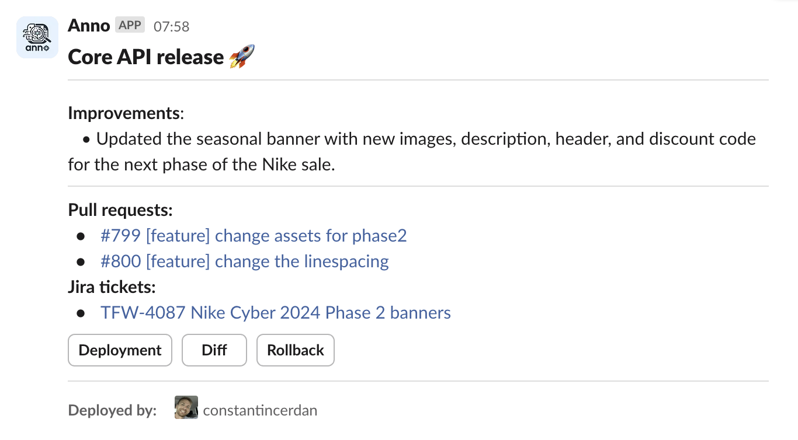

# **Anno**
Anno is a **GitHub Action** that leverages LLMs to summarise code changes released between workflow runs and posts them to Slack:



It can also integrate with **Jira** to include titles and links for any issue numbers found in associated pull requests, branch names, or commit messages.

## **Usage**

The minimum required inputs are:
- `chat_gpt_api_key`
- `slack_webhook_url`
- `github_token`

The latter should be automatically available as a secret.

```yaml
uses: thesolesupplier/anno@v1
with:
  # App name for the Slack message.
  # Default: Repository name.
  app_name: ""

  # ChatGPT API key for chat completions.
  # Required.
  chat_gpt_api_key: ""

  # ChatGPT model to use.
  # Default: `gpt-4o`.
  chat_gpt_model: ""

  # GitHub token to access the repository. This should be automatically available as a secret.
  # Required.
  github_token: ${{ secrets.GITHUB_TOKEN }}

  # Enable Jira integration.
  # Default: `false`.
  jira_integration_enabled: "false"

  # Jira username and API key (base64 encoded `<username>:<api_token>`).
  # Required if Jira is enabled.
  jira_api_key: ""

  # Jira instance base URL (e.g., https://my-company.atlassian.net).
  # Required if Jira is enabled.
  jira_base_url: ""

  # Jira project key.
  # Required if Jira is enabled.
  jira_project_key:

  # Slack webhook URL for the release summary.
  # Required.
  slack_webhook_url: ""
```

**Note:** Ensure Anno requires the previous job(s) to complete first so that it runs only after your deployment is successful:

```yaml
jobs:
  prod-deploy:
    # ...deployment steps

  anno:
    uses: thesolesupplier/anno@v1
    needs:
      - prod-deploy
      # Add other job names here if needed
```


## Monorepo Usage

There shouldn't be any special setup required for monorepos. Anno will download the workflow file and use the [`on.push.paths`](https://docs.github.com/en/actions/writing-workflows/workflow-syntax-for-github-actions#example-including-paths) and [`on.push.paths-ignore`](https://docs.github.com/en/actions/writing-workflows/workflow-syntax-for-github-actions#example-excluding-paths) properties to determine which files and commits to include in its analysis:

```yaml
on:
  push:
    paths:
      - 'sub-project/**'
      - '!sub-project/docs/**'
```

If neither are specified, Anno will default to the entire repository.

## API Features

Anno also has an API that can be deployed as an AWS HTTP Lambda that integrates with Jira and GitHub webhooks to review pull requests and add test cases to Jira issues.

For more details, see the API's [README](api/README.md).